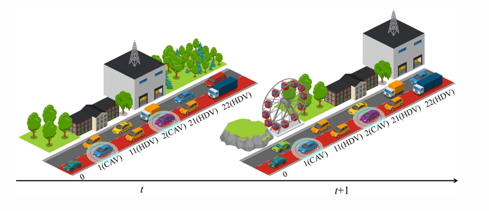

# AdapKoopPC

**AdapKoopPC** is a refactored implementation of adaptive deep Koopman predictive control for mitigating traffic oscillations in mixed traffic flow.

<p align="center">
  
</p>

This repository focuses on the runnable control/simulation path used by the paper. It keeps only the pretrained checkpoint needed by the current controller:

```text
checkpoints/true_new_64/
  epoch8_ds.tar
  epoch8_st.tar
  epoch8_e.tar
  epoch8_k.tar
```

For a more visual explanation of the method and paper figures, see [docs/overview.md](docs/overview.md).
For checkpoint-compatibility notes behind the model refactor, see [docs/developer_notes.md](docs/developer_notes.md).

## Highlights

- Checkpoint-compatible refactor of AdapKoopnet and AdapKoopPC
- Standard Python package layout with CLI entry points
- Deterministic default 50-vehicle mixed-platoon simulation
- Structured outputs: `.npz` simulation arrays, JSON metrics, CSV vehicle summaries
- Paper figures converted from LaTeX PDF assets to GitHub-friendly PNG files

## Install

Python 3.10+ is recommended.

```bash
python -m venv .venv
source .venv/bin/activate
pip install -r requirements.txt
```

On Windows PowerShell:

```powershell
python -m venv .venv
.\.venv\Scripts\Activate.ps1
pip install -r requirements.txt
```

Install a CPU or CUDA build of PyTorch that matches your machine if the default `pip install -r requirements.txt` does not select the desired build.

## Run

Quick smoke test:

```bash
python -m adapkoop_pc --steps 45 --output-dir outputs/smoke --progress
```

Default 50-vehicle control simulation:

```bash
python -m adapkoop_pc --output-dir outputs/control_50veh --progress
```

Equivalent script entry:

```bash
python scripts/run_control.py --output-dir outputs/control_50veh --progress
```

The command writes:

- `simulation_result.npz`: platoon arrangement, vehicle states, lead reference, control inputs, and computation time
- `metrics.json`: key scalar metrics and the exact configuration
- `vehicle_summary.csv`: per-vehicle summary statistics

## Configuration

Common options:

```bash
python -m adapkoop_pc \
  --checkpoint-dir checkpoints/true_new_64 \
  --epoch 8 \
  --vehicles 50 \
  --steps 1550 \
  --horizon 10 \
  --cav-penetration 0.3 \
  --truck-penetration 0.2
```

Default reproducibility settings:

- 50 vehicles
- 30% CAV penetration
- 20% truck penetration
- 0.12 s simulation step
- 10-step MPC horizon
- `true_new_64/epoch8` checkpoint
- deterministic platoon arrangement seed `30`
- NumPy/Torch seed `72`

## Project Layout

```text
adapkoop_pc/
  config.py          Dataclass configuration and legacy-argument bridge
  models.py          AdapKoopnet modules with checkpoint-compatible layer names
  simulation.py      Main AdapKoopPC simulation loop
  vehicle.py         IDM-based vehicle state model
  kmpc/              Koopman MPC matrix builder and optimizer
checkpoints/         Current pretrained control checkpoint
docs/                Paper overview and converted figure assets
outputs/             Generated results, ignored by git
```

## Citation

If this repository helps your research, please cite:

```bibtex
@article{lyu2026adapkooppc,
  title   = {Mitigating traffic oscillations in mixed traffic flow with scalable deep Koopman predictive control},
  author  = {Lyu, Hao and Guo, Yanyong and Liu, Pan and Zheng, Nan and Wang, Ting and Yue, Quansheng},
  journal = {Advanced Engineering Informatics},
  volume  = {71},
  pages   = {104258},
  year    = {2026},
  doi     = {10.1016/j.aei.2025.104258}
}
```

## Notes

The original research workspace also contained training, prediction evaluation, and plotting scripts that depended on large HighD `.mat` files. Those files are not required for the control simulation above and are intentionally not included in this open-source-ready refactor.
