# Method Overview

This page provides a visual guide to the AdapKoopPC codebase and the paper assets included with the repository. The figures were converted from the LaTeX project PDF assets into PNG files so they render directly on GitHub.

## Mixed Traffic System

AdapKoopPC controls connected automated vehicles (CAVs) in a local mixed traffic system while modeling the surrounding human-driven vehicles (HDVs) with learned Koopman dynamics.


The controller minimizes traffic oscillations through rolling optimization of CAV jerk inputs while keeping the mixed platoon in a tractable lifted linear representation.

## Prediction Model: AdapKoopnet

AdapKoopnet maps nonlinear HDV car-following behavior into a Koopman observable space. The learned lifted state evolves linearly, which makes it suitable for embedding into model predictive control.

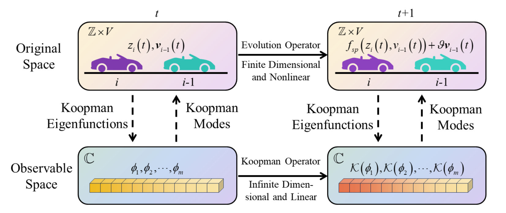

The architecture combines driving-style/context extraction with Koopman lifting, Koopman transition, and decoding modules.

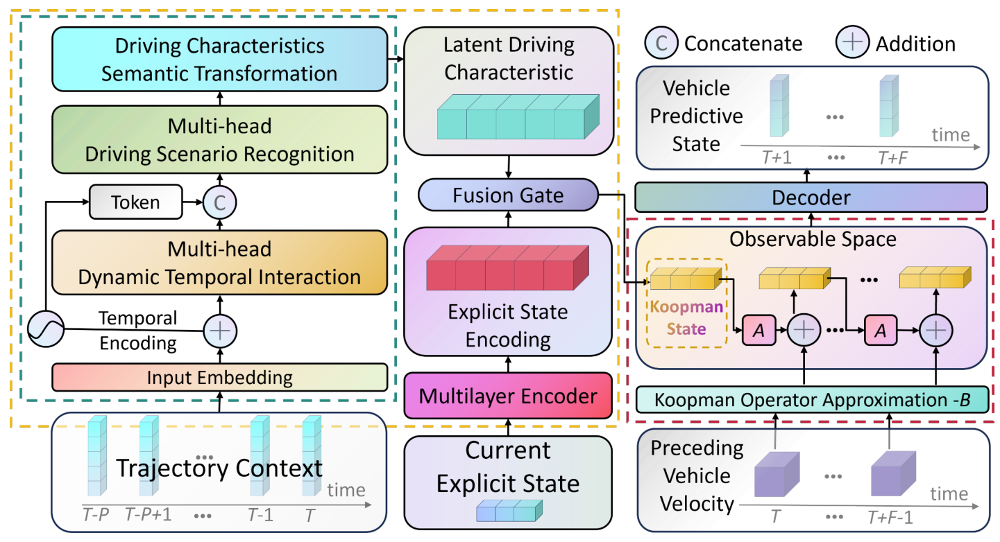

The detailed DSR and DCSE modules are shown below.

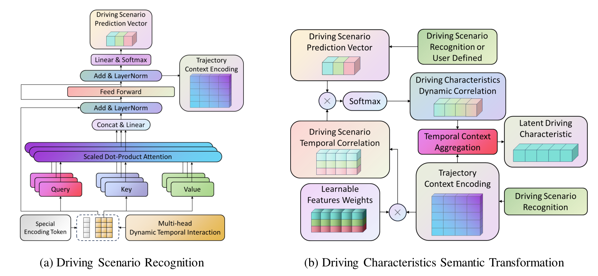

## Control Pipeline: AdapKoopPC

The control framework adapts the learned HDV Koopman blocks to the current vehicle composition, builds lifted mixed-traffic system matrices, and solves an MPC problem at each simulation step.

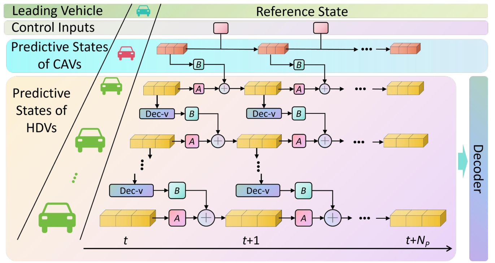

In code, this corresponds to:

```text
adapkoop_pc/models.py          neural Koopman model modules
adapkoop_pc/kmpc/matrix.py     lifted mixed-traffic matrix construction
adapkoop_pc/kmpc/optimizer.py  MPC objective and bounds
adapkoop_pc/simulation.py      rolling simulation and control loop
```

## Prediction Results

The paper validates AdapKoopnet on HDV longitudinal trajectory prediction.

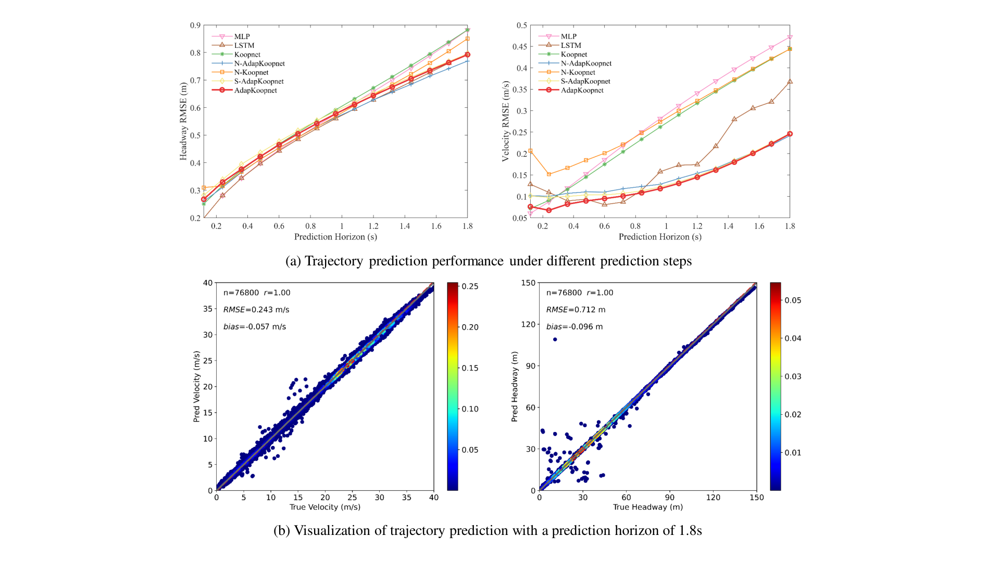

The model also learns adaptive multi-driving scenario representations from trajectory history.

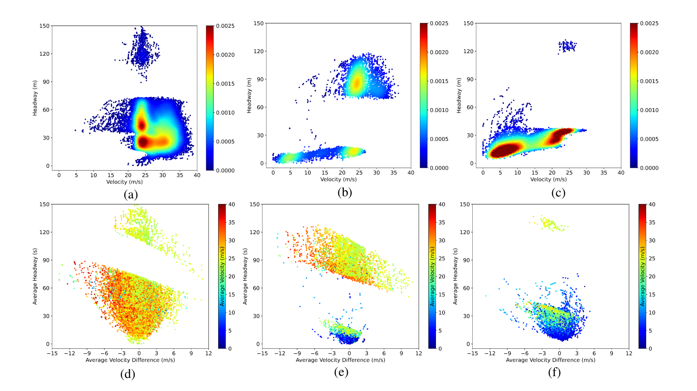

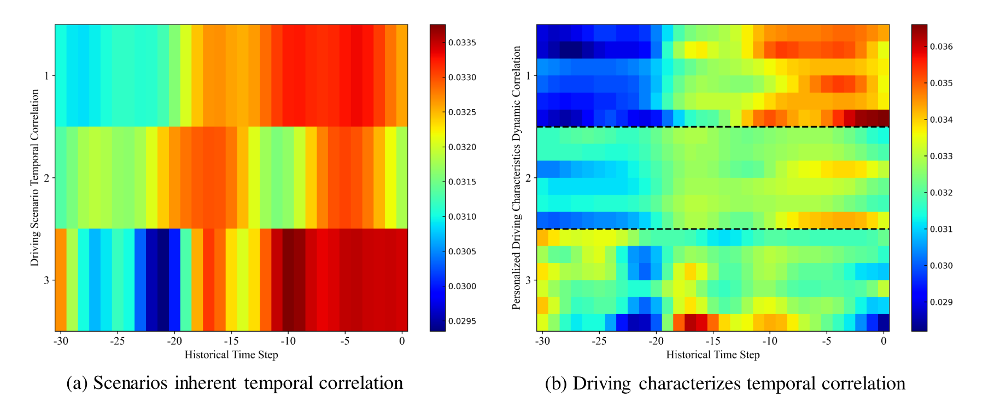

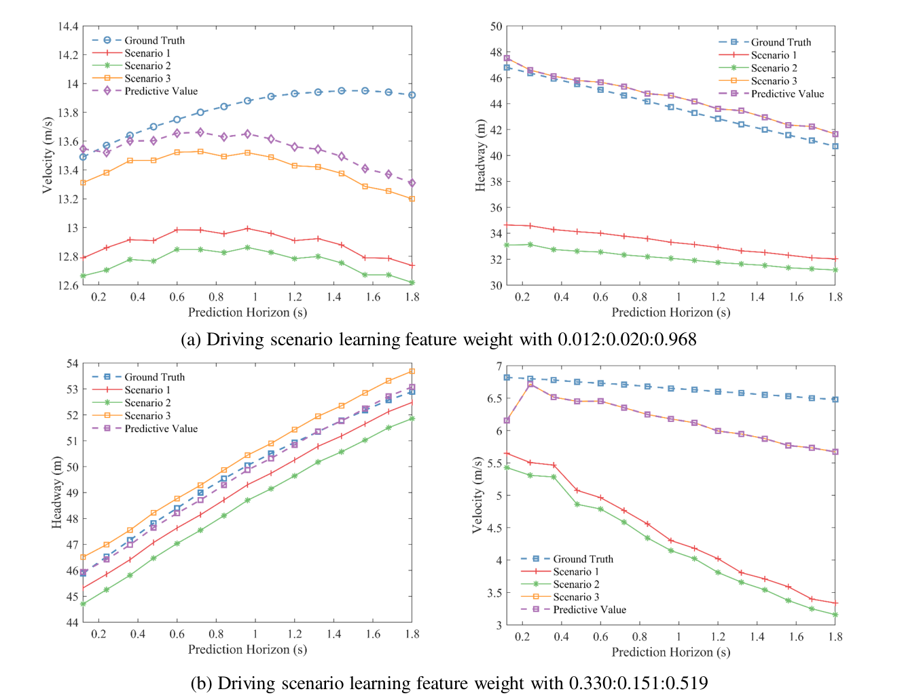

## Control Results

AdapKoopPC is evaluated against mixed-traffic control baselines by comparing velocity and headway evolution under oscillatory leading-vehicle disturbances.

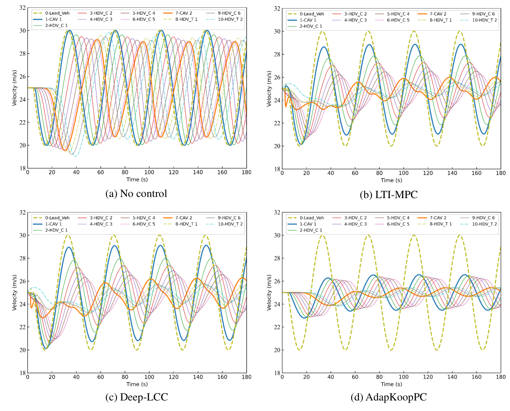

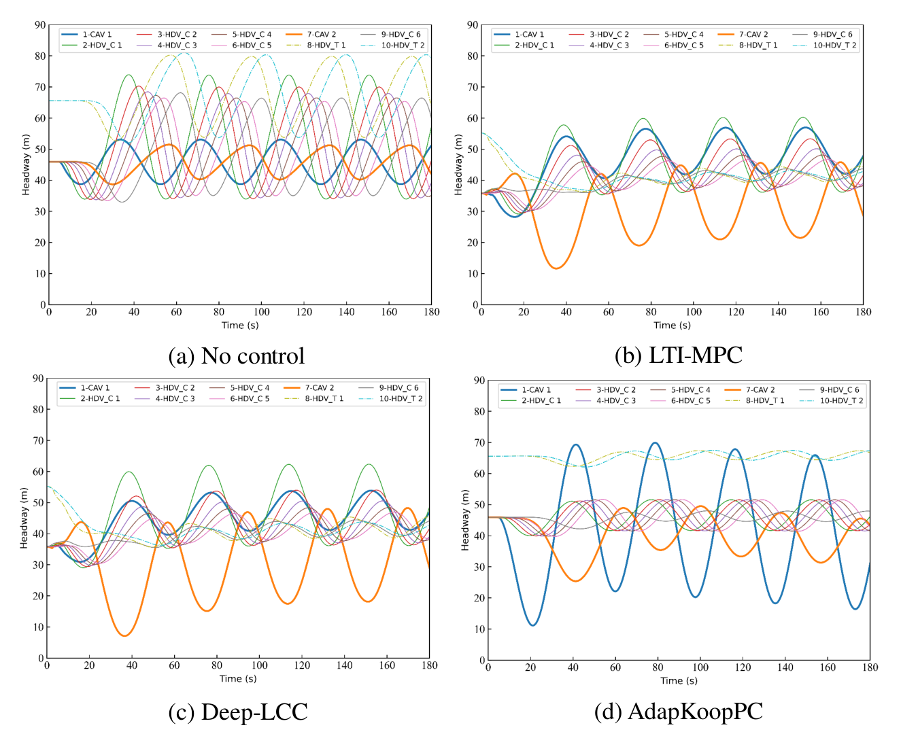

The controller remains effective under different CAV penetration rates, communication conditions, and CAV distributions.

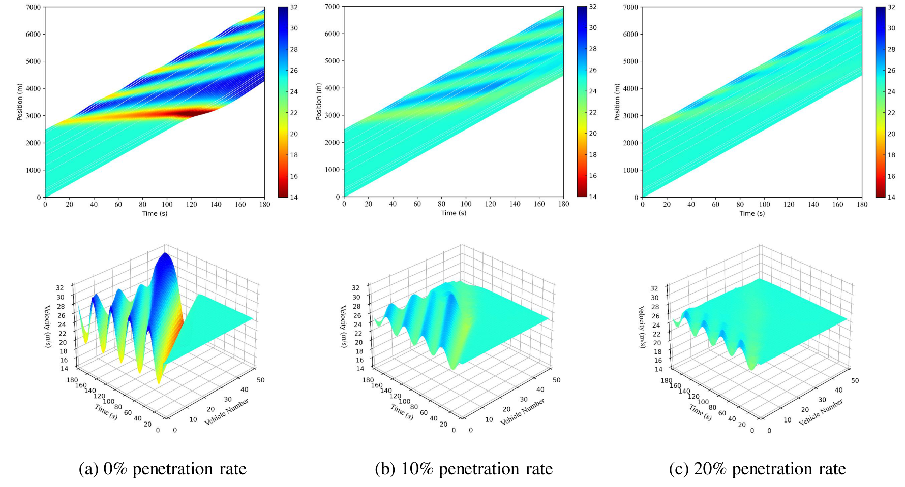

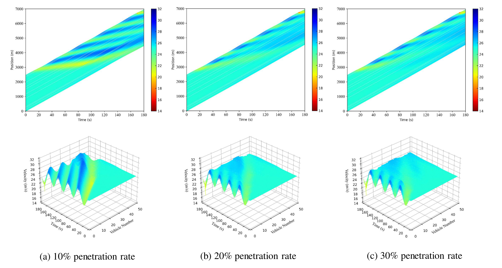

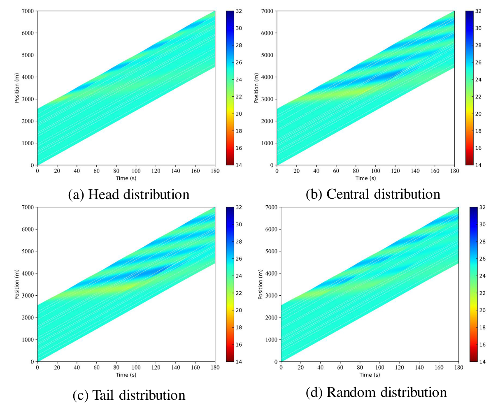

Additional robustness checks include noisy HDV state observations and a high-fidelity PeMTFLN background traffic model.

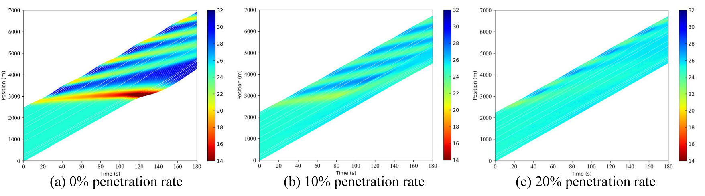

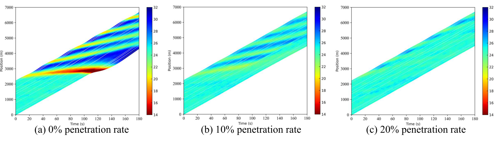

## BibTeX

```bibtex
@article{lyu2026adapkooppc,
  title   = {Mitigating traffic oscillations in mixed traffic flow with scalable deep Koopman predictive control},
  author  = {Lyu, Hao and Guo, Yanyong and Liu, Pan and Zheng, Nan and Wang, Ting and Yue, Quansheng},
  journal = {Advanced Engineering Informatics},
  volume  = {71},
  pages   = {104258},
  year    = {2026},
  doi     = {10.1016/j.aei.2025.104258}
}
```
